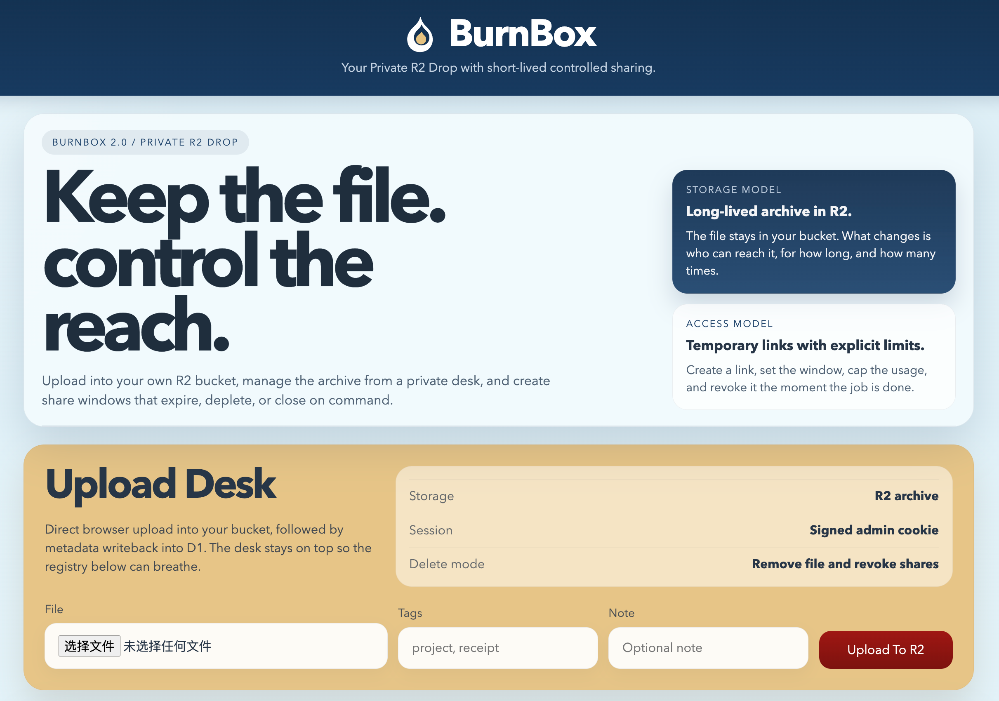

<div align="center">

# BurnBox

**Private R2 drop workspace for controlled file release, short-lived capability sharing, and durable operator ownership.**

`Cloudflare Workers` · `R2` · `D1` · `Server-rendered HTML/CSS/JS` · `GPL-3.0`

*Last updated: April 9, 2026 at 5:42 AM PDT*

<p>
  
  
  
  
  
</p>

</div>

---

## Contents

- [Why BurnBox Exists](#why-burnbox-exists)
- [Why This Repository Is Public](#why-this-repository-is-public)
- [Stack](#stack)
- [Changelog](#changelog)
- [Workspace Preview](#workspace-preview)
- [Technical Philosophy](#technical-philosophy)
- [Technical Significance](#technical-significance)
- [Research Significance](#research-significance)
- [Core Upload Architecture](#core-upload-architecture)
- [Features](#features)
- [Project Structure](#project-structure)
- [Quick Start](#quick-start)
- [Documentation](#documentation)
- [Contribution and Security](#contribution-and-security)
- [Security Model](#security-model)
- [Notes](#notes)
- [License](#license)

## Why BurnBox Exists

BurnBox is built for a narrow but important operational model:

- the file remains in infrastructure you control
- administration happens in a private workspace, not a public upload surface
- external access is treated as a revocable capability
- expiration, download limits, and revocation are first-class controls

This project is intentionally not a generic public file-sharing site. It is a compact control plane for issuing and withdrawing access to files already stored in your own bucket.

## Why This Repository Is Public

BurnBox began as a private operational tool. It is being opened because small, security-conscious systems are worth studying in the open.

Too much modern tooling is either oversized for the job or hidden behind proprietary operational complexity. BurnBox takes the opposite position: a narrow system, a legible architecture, and explicit control over storage, access, and revocation.

Publishing it is valuable for three reasons:

- to show that a useful internal tool can remain small, auditable, and technically honest
- to offer a practical reference for builders who want edge-native control planes without a multi-service platform
- to contribute a concrete example of capability-based distribution, where access can disappear without pretending the underlying file never existed

Open-sourcing this project is not just distribution. It is a statement that operational clarity, constrained scope, and inspectable infrastructure still matter, especially when the system touches storage, trust, and release control.

## Stack

- Cloudflare Workers for routing, session enforcement, upload coordination, share validation, and response delivery
- Cloudflare R2 for durable object storage
- Cloudflare D1 for file metadata, upload state, share state, and audit records
- Plain server-rendered HTML, CSS, and JavaScript for a minimal deployment surface
- `aws4fetch` for R2-compatible request signing

## Changelog

### April 9, 2026 · Chunked multipart upload refactor

- moved the upload path from optimistic single-request transfer to a chunked multipart model
- adopted 5 MiB chunk slicing for stability-first transfer behavior
- introduced Worker-mediated upload-part handling and R2 multipart assembly
- added D1-backed upload plans and uploaded-part tracking
- added truthful transfer progress with an explicit finalization phase
- established the upload subsystem as the primary technical focus of BurnBox 2.0.0

### April 9, 2026 · Major refactor

- rebuilt BurnBox around a single Cloudflare Worker, R2, and D1 architecture
- replaced the legacy public-upload flow with a private admin workspace
- introduced signed admin sessions and hashed share-token storage
- shipped direct browser-to-R2 upload with metadata writeback into D1
- redesigned the interface, share controls, and documentation structure for public release
- separated local-only material from the future open-source repository layout

## Workspace Preview



## Technical Philosophy

- Keep the architecture thin enough to audit.
- Keep the operator in direct control of storage and access policy.
- Prefer capability invalidation over destructive file lifecycle tricks.
- Use Cloudflare-native primitives instead of layering an unnecessary backend stack.
- Make the whole system understandable to a single maintainer.

## Technical Significance

BurnBox demonstrates a practical pattern for private file operations on the edge:

- browser-driven administration inside a single Worker
- hashed share tokens instead of plaintext capability storage
- revocable, bounded distribution links on top of durable storage
- chunked multipart upload for reliability-sensitive edge ingestion
- a minimal reference architecture for secure operational tooling

## Research Significance

BurnBox is also a small research artifact in applied security and distributed systems practice:

- it models access as a temporary capability rather than permanent publication
- it separates object durability from audience reach
- it treats revocation, bounded consumption, and auditability as system primitives
- it turns upload reliability into an explicit state-machine problem instead of a hidden transport assumption

For researchers and builders, the project is useful as a concrete example of how edge infrastructure can host narrow, security-conscious operator tools without expanding into a conventional multi-service platform.

## Core Upload Architecture

The core technical challenge in BurnBox 2.0.0 is upload reliability.

The project originally started from a smaller single-request upload model, but the real workload quickly made that approach too optimistic for installers, binary packages, and other large artifacts. BurnBox now treats upload as a stateful systems problem, not a single HTTP event.

The current design uses:

- 5 MiB chunk slicing
- Worker-mediated chunk transport
- R2 multipart assembly
- D1-backed upload planning and uploaded-part tracking
- an explicit finalization phase between transfer completion and ready-state visibility

This upload subsystem is the most important technical component in the project because it is the point where browser behavior, network volatility, edge execution, object assembly, and metadata consistency all meet.

Read the full design note here:

- [Concurrent Chunked Upload Design](docs/en/concurrent-chunked-upload.md)

## Features

- Signed admin session with `HttpOnly` cookie
- Chunked multipart upload with 5 MiB slices
- D1-backed file, upload, and share metadata
- Temporary share links with expiration or download limits
- Share revocation
- File deletion with related share invalidation
- Minimal single-worker architecture

## Project Structure

- `src/worker.js`: Worker entrypoint and route handling
- `src/lib/http.js`: response helpers, cookie parsing, and timing-safe comparison
- `src/lib/audit.js`: audit log write helper
- `src/lib/session.js`: signed session handling
- `src/lib/files.js`: upload planning, part upload, multipart completion, deletion
- `src/lib/shares.js`: share creation, revoke, and download resolution
- `src/lib/repository.js`: file list query layer
- `migrations/0001_initial.sql`: initial D1 schema
- `migrations/0002_upload_plans.sql`: upload plan table for server-validated completion flow
- `migrations/0003_multipart_uploads.sql`: multipart upload state extensions and uploaded-part tracking

## Quick Start

1. Install dependencies.

```bash
npm install
```

2. Copy `wrangler.toml.template` to `wrangler.toml` and replace the placeholders.

3. Create one R2 bucket and one D1 database in Cloudflare.

4. Apply the schema.

```bash
npx wrangler d1 execute burnbox --remote --file=./migrations/0001_initial.sql
npx wrangler d1 execute burnbox --remote --file=./migrations/0002_upload_plans.sql
npx wrangler d1 execute burnbox --remote --file=./migrations/0003_multipart_uploads.sql
```

5. Configure production secrets.

```bash
npx wrangler secret put ADMIN_PASSWORD
npx wrangler secret put SESSION_SECRET
npx wrangler secret put R2_ACCESS_KEY_ID
npx wrangler secret put R2_SECRET_ACCESS_KEY
```

6. Create local development secrets.

Create a `.dev.vars` file for `wrangler dev --remote`:

```env
ADMIN_PASSWORD=your-local-admin-password
SESSION_SECRET=your-long-random-session-secret
R2_ACCESS_KEY_ID=your-r2-access-key-id
R2_SECRET_ACCESS_KEY=your-r2-secret-access-key
```

7. Start remote development.

```bash
npm run dev
```

## Documentation

- [Documentation index](docs/README.md)
- English
  - [Quickstart](docs/en/quickstart.md)
  - [Deployment](docs/en/deployment.md)
  - [Architecture](docs/en/architecture.md)
  - [Concurrent Chunked Upload Design](docs/en/concurrent-chunked-upload.md)
  - [Troubleshooting](docs/en/troubleshooting.md)
  - [Repository Boundaries](docs/en/repository-boundaries.md)
- Japanese
  - [Japanese Quickstart](docs/ja/quickstart.md)
  - [Japanese Deployment](docs/ja/deployment.md)
  - [Japanese Architecture](docs/ja/architecture.md)
  - [Japanese Concurrent Chunked Upload Design](docs/ja/concurrent-chunked-upload.md)
  - [Japanese Troubleshooting](docs/ja/troubleshooting.md)
  - [Japanese Repository Boundaries](docs/ja/repository-boundaries.md)

## Contribution and Security

- Read [CONTRIBUTING.md](CONTRIBUTING.md) before opening a pull request.
- Read [SECURITY.md](SECURITY.md) before reporting a vulnerability or discussing a security-sensitive issue.

## Security Model

- The admin workspace is private and session-protected.
- Share tokens are stored as hashes, not plaintext.
- File objects are durable by default in R2.
- Share capability can expire, be exhausted, or be revoked.
- Download responses use `Cache-Control: private, no-store`.

## Notes

- Chunked multipart upload is now the primary ingestion path.
- Direct browser uploads require the expected Worker route and production secrets to be configured correctly.
- Local `wrangler dev --remote` expects `.dev.vars` so the Worker can read secrets during development.
- Protect `POST /api/auth/login` with a Cloudflare WAF or rate-limit rule in production.
- Example configuration files in this repository use placeholders only.

## License

This project is released under the terms of the [GPL v3](LICENSE).

---

<div align="center">

Built for private file operations on the edge.  
Maintained as a Cloudflare-native reference for controlled distribution workflows.

</div>
