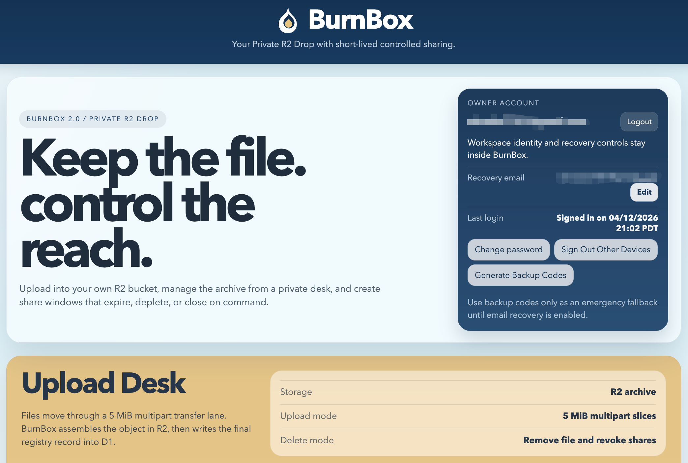

<div align="center">

# BurnBox

**Private R2 drop workspace for controlled file release, short-lived capability sharing, and durable operator ownership.**

`Cloudflare Workers` · `R2` · `D1` · `Server-rendered HTML/CSS/JS` · `GPL-3.0`

<p>
  
  
  
  
  
</p>

</div>

---

## Contents

- [Why BurnBox Exists](#why-burnbox-exists)
- [Why This Repository Is Public](#why-this-repository-is-public)
- [Stack](#stack)
- [Changelog](#changelog)
- [Workspace Preview](#workspace-preview)
- [Technical Philosophy](#technical-philosophy)
- [Engineering Difficulty](#engineering-difficulty)
- [Common Misconceptions](#common-misconceptions)
- [Current Response](#current-response)
- [Technical Significance](#technical-significance)
- [Core Architecture](#core-architecture)
- [Features](#features)
- [Project Structure](#project-structure)
- [Quick Start](#quick-start)
- [Documentation](#documentation)
- [Research Directions](#research-directions)
- [Contribution and Security](#contribution-and-security)
- [Legal Position](#legal-position)
- [Legal Notices](#legal-notices)
- [Security Model](#security-model)
- [Notes](#notes)
- [License](#license)

## Why BurnBox Exists

BurnBox is built for a narrow operational model:

- the file remains in infrastructure you control
- administration happens in a private workspace, not a public upload surface
- external access is treated as a revocable capability
- expiration, download limits, and revocation are first-class controls

This project is intentionally not a generic public file-sharing site. It is a compact control plane for issuing and withdrawing access to files already stored in your own bucket.

## Why This Repository Is Public

BurnBox began as a private operational tool. It is being opened because small, security-conscious systems are worth studying in the open.

Publishing it is useful for three reasons:

- it shows that an internal tool can remain small, auditable, and operationally honest
- it offers a practical edge-native reference for builders who want direct control over storage and capability links
- it documents a concrete pattern where file durability and external reach are intentionally separated

## Stack

- Cloudflare Workers for routing, session enforcement, upload coordination, share validation, and response delivery
- Cloudflare R2 for durable object storage
- Cloudflare D1 for file metadata, upload state, share state, and audit records
- Plain server-rendered HTML, CSS, and JavaScript for a minimal deployment surface
- native Workers R2 multipart APIs for object assembly inside the Worker

## Changelog

### April 13, 2026 · BurnBox 2.2.2 Frontend JS Refactor · 6:45 PM PDT

- separates the monolithic workspace inline script into five focused client modules: `helpers`, `share`, `files`, `upload`, and `boot-wiring`
- `layout.js` now composes the page script from imported modules instead of carrying all frontend JS detail inline
- preserves `boot.apiBase` and `boot.appEntryPath` as the sole source of private API paths — no bare `/api/...` strings reintroduced
- keeps Logout, Refresh, Upload, share create/revoke, and all account security actions stable under prefixed private-entry routes
- no product behavior changes, no new API routes, no new capabilities — structural maintainability pass only
- establishes a cleaner frontend module boundary ahead of the resumable upload work in 2.3.0

Developer guidance for this release:

- [Quickstart](docs/en/quickstart.md)
- [Deployment](docs/en/deployment.md)
- [Architecture](docs/en/architecture.md)
- [Development Plan](docs/en/development-plan.md)
- [Documentation index](docs/README.md)

<details>
<summary>Older changelog entries</summary>

### April 13, 2026 · BurnBox 2.2.1 Upload Diagnostics and Private Entry Release · 6:06 AM PDT

- ships deployment-managed private workspace entry support through `APP_ENTRY_PATH`
- moves private workspace pages and private API routes under the derived private entry prefix instead of exposing the admin surface at the root path by default
- adds operator-visible `Private entry` display inside the workspace without making the route editable from the UI
- adds upload-diagnostics aggregation for unfinished or failed uploads so operators can inspect multipart progress from durable server-side state
- hardens multipart consistency with explicit abort cleanup on failed uploads and compensating object deletion when metadata commit fails after multipart completion
- adds a private-entry smoke check to keep prefixed workspace routing from regressing
- keeps the owner-account auth baseline from 2.2.0 intact while preparing a smaller frontend-JS refactor before resumable upload

Developer guidance for this release:

- [Quickstart](docs/en/quickstart.md)
- [Deployment](docs/en/deployment.md)
- [Architecture](docs/en/architecture.md)
- [Development Plan](docs/en/development-plan.md)
- [Release Checklist](docs/en/release-checklist.md)
- [Troubleshooting](docs/en/troubleshooting.md)
- [Documentation index](docs/README.md)

### April 12, 2026 · BurnBox 2.2.0 Owner Account and Security Upgrade · 8:36 PM PDT

- ships owner-account authentication inside the product instead of relying on a long-lived deployment password
- adds `Claim your BurnBox` for first-run setup and `Upgrade your BurnBox security` for legacy `ADMIN_PASSWORD` deployments
- moves password change, recovery-email management, backup-code regeneration, logout, and device-session control into the workspace
- hardens auth behavior with generic invalid-credential logging, recovery lockouts, legacy-login throttling, claim-token atomicity, and password-hash sanitization
- keeps public share delivery, multipart upload, and stable `/h/{publicHandle}` links intact while upgrading the workspace auth model
- refreshes the public README and operator docs so deployment, migration, upgrade, and recovery behavior all describe the shipped 2.2.0 system
- adds a legal-risk documentation baseline that clarifies BurnBox as a self-hosted tool author project and assigns deployment compliance duties to instance operators

Developer guidance for this release:

- [Quickstart](docs/en/quickstart.md)
- [Deployment](docs/en/deployment.md)
- [Architecture](docs/en/architecture.md)
- [Development Plan](docs/en/development-plan.md)
- [Release Checklist](docs/en/release-checklist.md)
- [Documentation index](docs/README.md)

### April 11, 2026 · BurnBox 2.1.1 Reliability and Research Release · 12:18 PM PDT

- moved multipart assembly fully onto native Workers R2 APIs and removed the extra S3-compatible signing hop
- clarified retry ownership so transient recovery lives in the client instead of expanding Worker execution paths
- tightened multipart completion behavior and reduced avoidable per-part coordination overhead
- validated stable multipart transfers from `419` parts through `4.3 GB / 870 parts` and `11 GB / 2200 parts`, reinforcing the cumulative-reliability diagnosis
- rewrote the public docs to explain why large-file edge upload is a stateful systems problem rather than a simple timeout problem
- established three graduate-level research directions for the project: resumable multipart protocols, cost-aware coordination state, and capability-oriented public distribution
- established resumable upload as the next engineering baseline to reduce restart cost after interruption
- refined public-facing failure interaction so external entry points now present tighter and more consistent error behavior under invalid or unavailable requests

Developer guidance for this release:

- [Concurrent Chunked Upload Design](docs/en/concurrent-chunked-upload.md)
- [Architecture](docs/en/architecture.md)
- [Share Link Delivery Architecture](docs/en/share-link-delivery.md)
- [Development Plan](docs/en/development-plan.md)
- [Documentation index](docs/README.md)

### April 10, 2026 · BurnBox 2.1.0 Share-Domain Release · 7:14 PM PDT

- shipped split-domain sharing with a private workspace domain and a public share domain
- introduced `public_handle` as the stable public identifier for share links
- changed the default stable share URL to `https://relay.example.net/h/{publicHandle}`
- kept legacy `/s/{token}` links for compatibility instead of breaking existing shares
- removed the mandatory share landing page from the default flow and restored direct-download behavior
- fixed cross-device `Copy link` behavior by making active share URLs reconstructable on the server
- documented Cloudflare DNS, route, and certificate constraints for hostname-style sharing

### April 9, 2026 · Major Refactor and Chunked Upload Rollout · 5:42 AM PDT

- rebuilt BurnBox around a single Cloudflare Worker, R2, and D1 architecture
- replaced the legacy public-upload flow with a private admin workspace
- introduced signed admin sessions and hashed share-token storage
- redesigned the interface, share controls, and documentation structure for public release
- moved the upload path from optimistic single-request transfer to a chunked multipart model
- adopted 5 MiB chunk slicing for stability-first transfer behavior
- added D1-backed upload plans and uploaded-part tracking

</details>

## Workspace Preview



This screenshot is an illustrative example of one BurnBox workspace configuration. It does not represent a required or final deployment appearance. Fork operators may redesign the interface, policy surface, and operational presentation of their own deployments, and they remain responsible for the legal and platform obligations of those deployments.

## Technical Philosophy

- Keep the architecture thin enough to audit.
- Keep the operator in direct control of storage and access policy.
- Prefer capability invalidation over destructive file lifecycle tricks.
- Use Cloudflare-native primitives instead of layering an unnecessary backend stack.
- Make the whole system understandable to a single maintainer.

## Engineering Difficulty

BurnBox looks small at the repository level, but its hardest problem is not UI or routing. The hardest problem is edge-native large-file transfer under real network volatility.

This class of system has unusually high demands because one operator action expands into a long-lived distributed pipeline:

- browser slicing and progress reporting
- repeated Worker request handling across hundreds of parts
- multipart object assembly in R2
- persistent upload-state bookkeeping in D1
- final readiness transition into a canonical file record

For small files, many design mistakes remain invisible. For larger artifacts, they stop being invisible and become operator-visible faults.

The practical lesson is simple: large-file upload on the edge is not one request that happens to be bigger. It is a multi-stage reliability problem whose failure probability accumulates with every additional part.

Read the deeper engineering notes here:

- [Architecture](docs/en/architecture.md)
- [Concurrent Chunked Upload Design](docs/en/concurrent-chunked-upload.md)

## Common Misconceptions

BurnBox is intentionally documented against several recurring but misleading intuitions:

- large uploads do not usually fail because of one mysterious size threshold; they fail because high part counts increase cumulative failure exposure
- network instability is not a frontend-only problem; it is amplified by the interaction between browser retries, Worker execution, storage APIs, and database state
- transfer completion is not the same as file readiness
- adding retries is not the same as building a recoverable upload protocol
- edge infrastructure does not remove the need for explicit intermediate state; it makes state design more important

These misconceptions matter because they produce the wrong fixes. If the diagnosis is "the timeout is too short", teams keep tuning timers. If the diagnosis is "this is a cumulative reliability system", teams redesign recovery, state ownership, and observability.

## Current Response

BurnBox's current upload path reflects the lessons above.

- `5 MiB` slices keep individual failures cheap while keeping request counts manageable
- the Worker controls object identity and multipart finalization
- R2 multipart uses the native Workers binding instead of an extra S3-compatible hop
- upload state is persisted so the server can reason about part truth instead of trusting the browser
- transfer progress and finalization are presented as distinct phases
- the client owns transient retry behavior, while the Worker keeps the execution path short and legible
- current testing has validated stable completion through `4.3 GB / 870 parts` and `11 GB / 2200 parts`

This does not mean the upload problem is "solved forever". It means the system is being shaped toward the correct problem statement: cumulative reliability, not only bandwidth or timeout tuning. BurnBox 2.2.2 has now completed the frontend-JS maintainability pass, splitting the workspace inline script into focused client modules without changing any product behavior. The next implementation target is resumable upload in 2.3.0 so recovery can continue from durable part truth instead of restarting the entire transfer.

## Technical Significance

BurnBox demonstrates a practical pattern for private file operations on the edge:

- browser-driven administration inside a single Worker
- hashed share tokens instead of plaintext capability storage
- revocable, bounded distribution links on top of durable storage
- chunked multipart upload for reliability-sensitive edge ingestion
- split-domain delivery so public links do not have to expose the admin surface

## Core Architecture

The BurnBox 2.0.0 line solved upload reliability with chunked multipart ingest. The BurnBox 2.1.0 line extended that base into a share-delivery redesign. The BurnBox 2.1.1 line hardened multipart behavior and clarified the research direction. The BurnBox 2.2.0 line moved workspace authentication from a deployment-password pattern toward owner claim, upgrade flow, and in-product account security. The BurnBox 2.2.1 line adds private-entry routing, upload diagnostics, and multipart cleanup hardening on top of that baseline. The BurnBox 2.2.2 line completes the frontend-JS maintainability pass, separating the workspace inline script into focused client modules as a prerequisite for resumable upload.

The current share architecture uses:

- one private workspace domain such as `https://console.example.com`
- one public share domain such as `https://relay.example.net`
- stable public identifiers stored as `public_handle`
- direct-download share links using `/h/{publicHandle}`
- legacy `/s/{token}` compatibility for older issued links
- optional hostname-style sharing for operators who are willing to manage wildcard certificates

That route was chosen for a specific reason: the original token-based path could not be reconstructed across devices because only the token hash is stored in D1. `public_handle` fixes that by giving the system a stable public identifier that can be rebuilt from database state without exposing internal file or share IDs.

Read the technical notes here:

- [Architecture](docs/en/architecture.md)
- [Share Link Delivery Architecture](docs/en/share-link-delivery.md)
- [Concurrent Chunked Upload Design](docs/en/concurrent-chunked-upload.md)

## Features

- signed owner session with `HttpOnly` cookie
- chunked multipart upload with 5 MiB slices
- D1-backed file, upload, and share metadata
- split-domain sharing with share-domain URL generation
- stable share URLs using `public_handle`
- legacy token-link compatibility
- share revocation and download limits
- file deletion with related share invalidation
- owner-claim onboarding plus upgrade-path migration for workspace auth
- in-product password rotation, backup codes, optional recovery-email support, and session/device reset
- minimal single-worker architecture

## Project Structure

- `src/worker.js`: Worker entrypoint and route handling
- `src/lib/http.js`: response helpers, cookie parsing, and timing-safe comparison
- `src/lib/audit.js`: audit log write helper
- `src/lib/auth.js`: owner auth state, password hashing, claim, upgrade, recovery, and audit-safe auth logic
- `src/lib/session.js`: signed session handling
- `src/lib/files.js`: upload planning, part upload, multipart completion, deletion
- `src/lib/shares.js`: share creation, revoke, view/download resolution, and capability checks
- `src/lib/repository.js`: file list query layer and active share projection
- `src/lib/layout.js`: admin workspace rendering and client-side interaction logic
- `src/lib/auth-layout.js`: claim, sign-in, upgrade, and recovery page rendering
- `migrations/0001_initial.sql`: initial D1 schema
- `migrations/0002_upload_plans.sql`: upload plan table
- `migrations/0003_multipart_uploads.sql`: multipart upload state extensions
- `migrations/0004_share_public_handle.sql`: stable public share handle support
- `migrations/0005_owner_auth.sql`: owner account, claim token, recovery code, and auth event support

## Quick Start

If you want Claude, GPT, Codex, or another coding assistant to carry out the setup with you, use the dedicated handoff file first:

- [AI Deployment Handoff](docs/en/ai-deployment-handoff.md)

1. Install dependencies.

```bash
npm install
```

2. Copy `wrangler.toml.template` to `wrangler.toml` and replace the placeholders.

3. Create one R2 bucket and one D1 database in Cloudflare.

4. Apply the schema.

```bash
npx wrangler d1 execute <your-d1-database-name> --remote --file=./migrations/0001_initial.sql
npx wrangler d1 execute <your-d1-database-name> --remote --file=./migrations/0002_upload_plans.sql
npx wrangler d1 execute <your-d1-database-name> --remote --file=./migrations/0003_multipart_uploads.sql
npx wrangler d1 execute <your-d1-database-name> --remote --file=./migrations/0004_share_public_handle.sql
npx wrangler d1 execute <your-d1-database-name> --remote --file=./migrations/0005_owner_auth.sql
```

5. Configure production secrets.

```bash
npx wrangler secret put SESSION_SECRET
npx wrangler secret put SHARE_LINK_SECRET
npx wrangler secret put CLAIM_KEY
```

`SHARE_LINK_SECRET` is required. Share creation may still work without it, but public download links will fail until it is configured. `CLAIM_KEY` is only for one-time workspace claim when you are not using a log-generated claim code. It is not the long-lived owner password.

6. Start remote development.

```bash
npm run dev
```

7. Complete the auth path after startup.

- a fresh deployment should show `Claim your BurnBox`
- a legacy deployment should show the upgrade login path first
- after upgrade or claim, the workspace should support owner sign-in, password change, backup-code regeneration, and `Sign Out Other Devices`, with recovery email remaining an optional operator-managed setting

## Documentation

- [Documentation index](docs/README.md)
- English
  - [AI Deployment Handoff](docs/en/ai-deployment-handoff.md)
  - [Quickstart](docs/en/quickstart.md)
  - [Deployment](docs/en/deployment.md)
  - [Legal Risk Statement](docs/en/legal-risk-statement.md)
  - [Architecture](docs/en/architecture.md)
  - [Development Plan](docs/en/development-plan.md)
  - [Share Link Delivery Architecture](docs/en/share-link-delivery.md)
  - [Concurrent Chunked Upload Design](docs/en/concurrent-chunked-upload.md)
  - [Troubleshooting](docs/en/troubleshooting.md)
  - [Repository Boundaries](docs/en/repository-boundaries.md)
- Japanese
  - [AI Deployment Handoff (Japanese)](docs/ja/ai-deployment-handoff.md)
  - [Quickstart](docs/ja/quickstart.md)
  - [Deployment](docs/ja/deployment.md)
  - [Legal Risk Statement](docs/ja/legal-risk-statement.md)
  - [Architecture](docs/ja/architecture.md)
  - [開発計画](docs/ja/development-plan.md)
  - [Share Link Delivery Architecture](docs/ja/share-link-delivery.md)
  - [Concurrent Chunked Upload Design](docs/ja/concurrent-chunked-upload.md)
  - [Troubleshooting](docs/ja/troubleshooting.md)
  - [Repository Boundaries](docs/ja/repository-boundaries.md)

## Research Directions

BurnBox is not only a deployable operator tool. It is also a compact research vehicle for edge-native file control systems.

The longer-term research direction is to study how a small control plane can remain understandable while supporting failure-aware large-object movement across unreliable networks. Recent testing in this repository, including a stable `419`-part transfer without visible oscillation after architectural changes, reinforces that the most interesting questions are no longer about raw upload feasibility. They are about state, recovery, and control semantics.

Three graduate-level research directions follow.

### 1. Resumable Multipart Protocols for Edge-Controlled Upload

Research question:
How should a Worker-mediated upload protocol represent partial truth so that a large transfer can resume from failure without trusting the browser as the source of record and without forcing a whole-upload restart?

This direction includes:

- resumable part negotiation between browser and server
- persistent part-truth models that do not make every retry ambiguous
- recovery semantics after browser refresh, network loss, or partial state divergence
- comparative evaluation against naive retry-only upload designs

This is a strong systems thesis direction because it combines protocol design, failure semantics, and empirical evaluation under unstable networks.

### 2. Cost-Aware State Coordination for High-Part-Count Object Transfer

Research question:
What is the minimum persistent coordination state required to preserve correctness for multipart upload on the edge when part counts become large and per-part state writes begin to dominate reliability or cost?

This direction includes:

- formalizing which upload facts must be durable and which can remain ephemeral
- studying tradeoffs between per-part persistence, deferred reconciliation, and compact summary structures
- measuring the interaction between state-write pressure, latency, and end-to-end completion rate
- designing alternative coordination paths that preserve correctness while reducing storage-system amplification

This is suitable for a master's or PhD path because it turns an engineering pain point into a principled question about distributed state minimization.

### 3. Capability-Oriented Distribution and Operator-Controlled Public Reach

Research question:
How can edge-native file systems separate durability, public reach, and revocation into independently controllable layers without collapsing back into either fully public storage or opaque backend mediation?

This direction includes:

- formal models for share capabilities, bounded access windows, and revocation behavior
- stable public identifiers versus secret capability material
- architectural tradeoffs between direct delivery, redirect-based control points, and share-domain separation
- operator legibility: how much control and auditability can be preserved while still keeping the system small

This is the most architecture-oriented research direction in the project. It connects systems design, security semantics, and human-operable infrastructure.

The project's research thesis is that edge reliability is usually not blocked by missing infrastructure primitives. It is blocked by weak state models, misleading progress semantics, and under-specified recovery behavior.

## Contribution and Security

- Read [CONTRIBUTING.md](CONTRIBUTING.md) before opening a pull request.
- Read `SECURITY.md` before reporting a vulnerability or discussing a security-sensitive issue.

## Legal Position

BurnBox is published as self-hosted source code, not as a hosted public file service. The project author is the author of a general-purpose tool and does not operate third-party deployments. If you fork, deploy, or run a BurnBox instance for others, you are responsible for the legal and compliance obligations of that operation. Read the full [Legal Risk Statement](docs/en/legal-risk-statement.md).

## Legal Notices

Security reports about the BurnBox source project itself should follow [SECURITY.md](SECURITY.md). Complaints about files, links, copyright, abuse, privacy, or unlawful content on a third-party BurnBox deployment must be sent to the operator of that deployment, not to the upstream source-code repository. Each deployer should publish its own operator contact route, such as `abuse@your-domain.example` or `legal@your-domain.example`.

## Security Model

- The admin workspace is private and session-protected.
- Owner passwords are hashed with PBKDF2 and are never returned to the client.
- Recovery-code reset is rate-limited and returns generic failure responses.
- Legacy upgrade login is throttled so the transitional password path is not left unbounded.
- Share tokens are stored as hashes, not plaintext.
- `public_handle` is a public identifier, not a secret.
- File objects are durable by default in R2.
- Share capability can expire, be exhausted, or be revoked.
- Download responses use `Cache-Control: private, no-store`.

## Notes

Every version of BurnBox has answered a different question. The first question was whether large files could move through the edge at all. They could, but not without a lesson: reliability at scale is not a bandwidth problem. It is a state problem. A system that cannot articulate what it knows after a failure cannot recover from one.

The second question was about identity. A share link is a capability — bounded, revocable, and attached to a specific act of trust between an operator and a recipient. When that distinction collapsed, as it does in systems where the same material serves as both a stable identifier and a secret, the share system lost something: the ability to say clearly who still has access and why. Separating `public_handle` from the token hash was not a refactor. It was a clarification of what kind of thing a link is.

The third question was about ownership. A deployment password written into an environment variable is not an owner. It is a shared secret with no memory, no recovery, and no face. Moving authentication into the product — claim, upgrade, password rotation, backup codes, session control — was an attempt to give the workspace something closer to a person at the other end of it.

What remains is the hardest question of all: how to return gracefully from the middle of things. An interrupted upload is not just a failed request. It is a system in a partially-committed state. The next step is to make that state legible and recoverable without forcing a restart from zero.

The documentation is written for any careful reader — human operator or AI coding assistant — who wants to carry a fresh fork into production without guessing. Placeholder domains are used throughout; keep personal infrastructure out of public version history. Hostname-style sharing is opt-in and requires explicit certificate management.

Recovery email should also be understood in that operator-controlled way. BurnBox can support an operator-managed recovery email, but a given self-hosted deployment may intentionally leave that path disabled and rely on backup codes as the primary recovery fallback. That is an operational choice, not a half-finished feature.

The Japanese documentation exists because good ideas travel better when they arrive in a familiar language. To the friends at Kyoto University who made that feel worth doing — thank you.

## License

This project is released under the terms of the [GPL v3](LICENSE).

---

<div align="center">

**A small system should remain legible, auditable, and under operator control.**

Built for private file operations on the edge.  
Maintained as a Cloudflare-native reference for controlled distribution workflows.

<sub>Last updated: April 13, 2026 at 6:06 AM PDT</sub>

</div>
