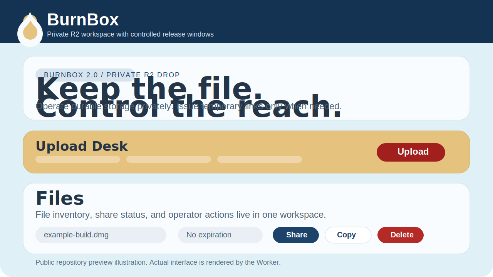

<div align="center">

# BurnBox

**Private R2 drop workspace for controlled file release, short-lived capability sharing, and durable operator ownership.**

`Cloudflare Workers` · `R2` · `D1` · `Server-rendered HTML/CSS/JS` · `GPL-3.0`

*Last updated: April 9, 2026 at 1:11 AM PDT*

<p>
  
  
  
  
  
</p>

</div>

---

## Contents

- [Why BurnBox Exists](#why-burnbox-exists)
- [Why This Repository Is Public](#why-this-repository-is-public)
- [Stack](#stack)
- [Changelog](#changelog)
- [Workspace Preview](#workspace-preview)
- [Technical Philosophy](#technical-philosophy)
- [Technical Significance](#technical-significance)
- [Research Significance](#research-significance)
- [Features](#features)
- [Project Structure](#project-structure)
- [Quick Start](#quick-start)
- [Documentation](#documentation)
- [Contribution and Security](#contribution-and-security)
- [Security Model](#security-model)
- [Notes](#notes)
- [License](#license)

## Why BurnBox Exists

BurnBox is built for a narrow but important operational model:

- the file remains in infrastructure you control
- administration happens in a private workspace, not a public upload surface
- external access is treated as a revocable capability
- expiration, download limits, and revocation are first-class controls

This project is intentionally not a generic public file-sharing site. It is a compact control plane for issuing and withdrawing access to files already stored in your own bucket.

## Why This Repository Is Public

BurnBox began as a private operational tool. It is being opened because small, security-conscious systems are worth studying in the open.

Too much modern tooling is either oversized for the job or hidden behind proprietary operational complexity. BurnBox takes the opposite position: a narrow system, a legible architecture, and explicit control over storage, access, and revocation.

Publishing it is valuable for three reasons:

- to show that a useful internal tool can remain small, auditable, and technically honest
- to offer a practical reference for builders who want edge-native control planes without a multi-service platform
- to contribute a concrete example of capability-based distribution, where access can disappear without pretending the underlying file never existed

Open-sourcing this project is not just distribution. It is a statement that operational clarity, constrained scope, and inspectable infrastructure still matter, especially when the system touches storage, trust, and release control.

## Stack

- Cloudflare Workers for routing, session enforcement, share validation, and response delivery
- Cloudflare R2 for durable object storage
- Cloudflare D1 for file metadata, share state, and audit records
- Plain server-rendered HTML, CSS, and JavaScript for a minimal deployment surface
- `aws4fetch` for R2-compatible request signing

## Changelog

### April 9, 2026 · Major refactor

- rebuilt BurnBox around a single Cloudflare Worker, R2, and D1 architecture
- replaced the legacy public-upload flow with a private admin workspace
- introduced signed admin sessions and hashed share-token storage
- shipped direct browser-to-R2 upload with metadata writeback into D1
- redesigned the interface, share controls, and documentation structure for public release
- separated local-only material from the future open-source repository layout

## Workspace Preview



## Technical Philosophy

- Keep the architecture thin enough to audit.
- Keep the operator in direct control of storage and access policy.
- Prefer capability invalidation over destructive file lifecycle tricks.
- Use Cloudflare-native primitives instead of layering an unnecessary backend stack.
- Make the whole system understandable to a single maintainer.

## Technical Significance

BurnBox demonstrates a practical pattern for private file operations on the edge:

- browser-to-bucket upload without a heavyweight application server
- session-protected administration inside a single Worker
- hashed share tokens instead of plaintext capability storage
- revocable, bounded distribution links on top of durable storage
- a minimal reference architecture for secure operational tooling

## Research Significance

BurnBox is also a small research artifact in applied security and distributed systems practice:

- it models access as a temporary capability rather than permanent publication
- it separates object durability from audience reach
- it treats revocation, bounded consumption, and auditability as system primitives
- it offers a compact example of edge-native control planes for sensitive asset release

For researchers and builders, the project is useful as a concrete example of how edge infrastructure can host narrow, security-conscious operator tools without expanding into a conventional multi-service platform.

## Features

- Signed admin session with `HttpOnly` cookie
- Direct browser upload to R2
- D1-backed file and share metadata
- Temporary share links with expiration or download limits
- Share revocation
- File deletion with related share invalidation
- Minimal single-worker architecture

## Project Structure

- `src/worker.js`: Worker entrypoint and route handling
- `src/lib/session.js`: signed session handling
- `src/lib/files.js`: upload planning, upload completion, deletion
- `src/lib/shares.js`: share creation, revoke, and download resolution
- `src/lib/repository.js`: file list query layer
- `migrations/0001_initial.sql`: initial D1 schema

## Quick Start

1. Install dependencies.

```bash
npm install
```

2. Copy `wrangler.toml.template` to `wrangler.toml` and replace the placeholders.

3. Create one R2 bucket and one D1 database in Cloudflare.

4. Apply the initial schema.

```bash
npx wrangler d1 execute burnbox --remote --file=./migrations/0001_initial.sql
```

5. Configure production secrets.

```bash
npx wrangler secret put ADMIN_PASSWORD
npx wrangler secret put SESSION_SECRET
npx wrangler secret put R2_ACCESS_KEY_ID
npx wrangler secret put R2_SECRET_ACCESS_KEY
```

6. Start remote development.

```bash
npm run dev
```

## Documentation

- [Documentation index](docs/README.md)
- English
  - [Quickstart](docs/en/quickstart.md)
  - [Deployment](docs/en/deployment.md)
  - [Architecture](docs/en/architecture.md)
  - [Troubleshooting](docs/en/troubleshooting.md)
  - [Repository Boundaries](docs/en/repository-boundaries.md)
- Japanese
  - [Japanese Quickstart](docs/ja/quickstart.md)
  - [Japanese Deployment](docs/ja/deployment.md)
  - [Japanese Architecture](docs/ja/architecture.md)
  - [Japanese Troubleshooting](docs/ja/troubleshooting.md)
  - [Japanese Repository Boundaries](docs/ja/repository-boundaries.md)

## Contribution and Security

- Read [CONTRIBUTING.md](CONTRIBUTING.md) before opening a pull request.
- Read [SECURITY.md](SECURITY.md) before reporting a vulnerability or discussing a security-sensitive issue.

## Security Model

- The admin workspace is private and session-protected.
- Share tokens are stored as hashes, not plaintext.
- File objects are durable by default in R2.
- Share capability can expire, be exhausted, or be revoked.
- Download responses use `Cache-Control: private, no-store`.

## Notes

- Direct browser uploads require R2 CORS configuration for your admin origin.
- Example configuration files in this repository use placeholders only.
- Public documentation timestamps are shown in California time (`PDT`) for release consistency.

## License

This project is released under the terms of the [GPL v3](LICENSE).

---

<div align="center">

Built for private file operations on the edge.  
Maintained as a Cloudflare-native reference for controlled distribution workflows.

</div>
